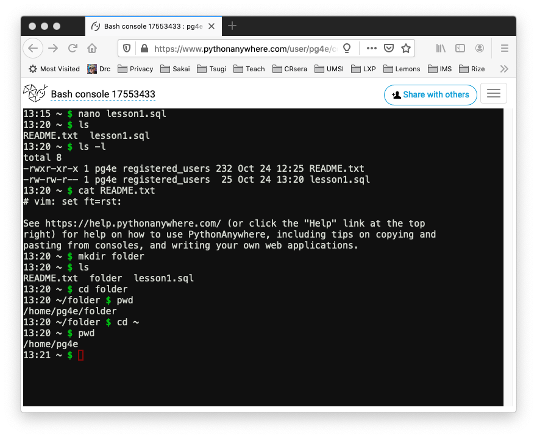

Using PostgreSQL on PythonAnywhere
==================================

You use <a href="https://www.pythonanywhere.com" target="_blank">PythonAnywhere</a>
to do the exercises for this course.  Follow their instructions to create a free/beginner
account.   You should not need anything beyond the free account for this account.

You can view a
<a href="https://youtu.be/a6-1bsy9kxw" target="_blank">video walkthrough</a>
of this handout.

Running Linux Commands in the Shell
-----------------------------------

Once you have created your PythonAnywhere account and logged in go to "Consoles" and create a new Bash console -
or simply go back into one of your consoles if you have one running.  Free accounts only get two consoles so
you do want to reuse them whenever you can.

You are using the Linux Bash command line.  It is like Windows Command Prompt or Apple Terminal program.
Many of the demonstrations in this course are done using the Apple Terminal program and the
exact same commands will work in the Linux shell.

At the '$' prompt you can type some Linux commands:

* **nano** (or other editor) to edit a text file
* **ls** to show files and folders
* **ls -l** to show file folders with permissions, file size, and modification date
* **cat** (stands for concatenate) - show the contents of a text files
* **mkdir** create a new folder
* **cd** (change directory) go into a new folder
* **pwd** (print working directory) - "Which folder am I in?"
* **cd ~** Go back to my home folder
* **clear** Clear the screen 

You can also edit files and make folders using the "Files" feature in the PythonAnywhere user interface.

Running PostgreSQL Commands in the Shell
----------------------------------------

The PostgreSQL client software (psql) is already installed on PythonAnywhere (thanks!) so no installation
step is needed.  You can just run the commands directly.   When you go into an assignment on this site it gives
you your connection details and even the `psql` command to run:

    Host:     pg.pg4e.com 
    Port:     5432 
    Database: pg4e_8aaa5842b6 
    User:     pg4e_8aaa5842b6 
    Password:  (hide/show copy)

    psql -h pg.pg4e.com -p 5432 -U pg4e_8aaa5842b6 pg4e_8aaa5842b6

You can copy the `psql` command into the shell and run it.  You will then be prompted for a password
which you can copy into the clipboard without showing it in the assignment and then pasting it into 
the PythonAnywhere shell when `psql` asks for your password.

Once you enter your password, you can run `psql` commands and SQL commands.

In this example, we type several commands:

* **\dt** - List all the tables in this database
* SELECT * FROM pg4e\_debug; - Show all the rows in the `pg4e_debug` table
* **\i** - Read SQL commands from a file and execute those commands
* **\q** - Exit the PostgreSQL command line

You will learn many SQL and `psql` commands throughout the rest of this course.

Editing Files on PythonAnywhere
-------------------------------

There are three ways to edit files in your PythonAnywhere environment, ranging from the easiest
to the coolest.  You only have to edit the file one of these ways.

(1) Go to the main PythonAnywhere dashboard, browse files, navigate to the correct folder and edit your file.

    /home/pg4e/lesson1.sql

(2) Or in the command line:

    cd ~
    nano lesson1.sql

    Save the File by pressing 'CTRL-X', 'Y', and Enter

(3) Don't try this most difficult and most cool way to edit files on Linux without a helper
if it is your first time with the `vi` text editor.

    cd ~
    vi lesson1.sql

The vi (or vim) editor is a very powerful text editor that is very well liked by a large fraction
(but by no means all) software developers.  You can take a look a the "How to Use Vim - Tutorial"
from Free Code Camp.

https://www.youtube.com/watch?v=g-XsXEsd6xA

Vi starts in command mode where you can move around the document using the cursor keys.  To edit the 
file you can and press the
`i` key to go into 'INSERT' mode, then type your new text and press the `esc` key when you are
done.  To save the file in command mode, you type `:wq` followed by `enter`.  If you get lost press `escape` `:q!`
`enter` to get out of the file without saving.

If you aleady know some _other_ command line text editor in Linux, you can use it to edit files.  In general,
you will find that it often quicker and easier to make small edits to files in the command line
rather than a full screen UI.  And once you start deploying real applications in production
environments like Google, Amazon, Microsoft, etc.. all you will have is command line.

