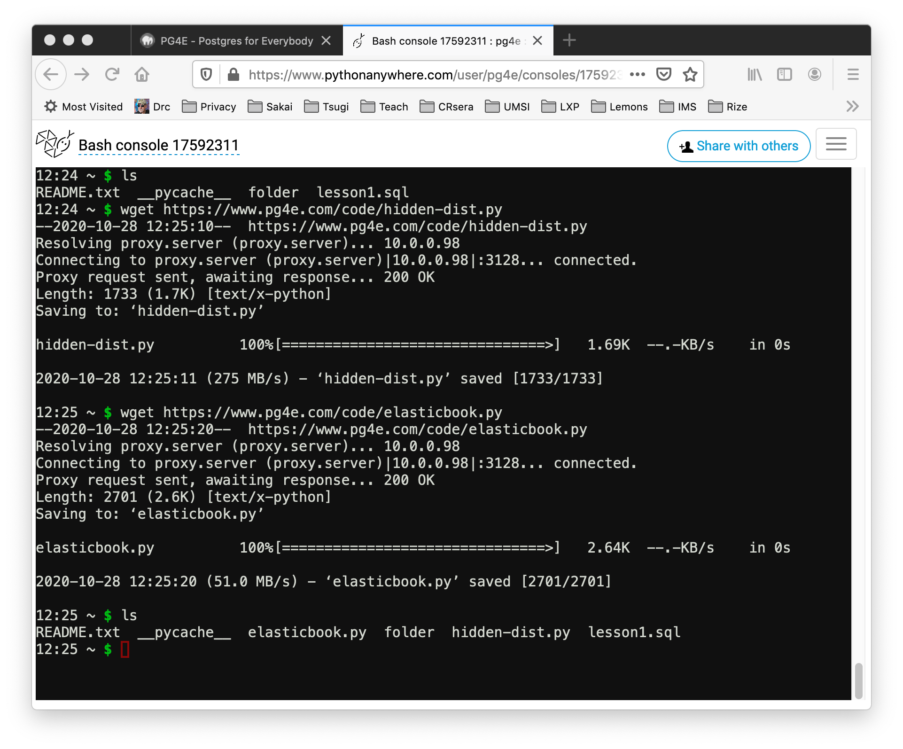

Using ElasticSearch on PythonAnywhere
=====================================

You use <a href="https://www.pythonanywhere.com" target="_blank">PythonAnywhere</a>
to do the exercises for this course.  Follow their instructions to create a free/beginner
account.   You should not need anything beyond the free account for this account.

<!--
You can view a
<a href="https://youtu.be/a6-1bsy9kxw" target="_blank">video walkthrough</a>
of this handout.
-->

Installing the Python Elastic Search Library
--------------------------------------------

Since PythonAnywhere is a shared environment, using `pip` the normal way will *not* work
unless you have created a virtual environment.

    pip install 'elasticsearch<7.14.0'

You can set up a virtual environment and then use `pip` or just add the `--user` parameter to pip.
Also make sure you are doing it for Python 3.

    pip3 install --user 'elasticsearch<7.14.0'

Downloading Files using Linux Command Line
------------------------------------------

Some of the assignments ask you to download a file with code or data to do an assignment.  You can do this
by saving the file in your browser to your local computer and then uploading the file to PythonAnywhere.  But
there is a much quicker way to do it using the command line and the `wget` command.

The `wget` command (you can also use `curl -O`) retrieves a file from the web and stores it locally.  For example
in the Linux Shell you can type:

    wget https://www.pg4e.com/code/elasticbook.py
    wget https://www.pg4e.com/code/hidden-dist.py
    wget https://www.pg4e.com/gutenberg/cache/epub/18866/pg18866.txt

And these files will be downloaded.

The beginner accounts on PythonAnywhere are behind a firewall so you
can only access pre-approved web sites - so don't be surprised if you get an error like:

    $ wget http://www.amazon.com/                                                           
    --2020-10-28 12:30:25--  http://www.amazon.com/                                                 
    Resolving proxy.server (proxy.server)... 10.0.0.98                                              
    Connecting to proxy.server (proxy.server)|10.0.0.98|:3128... connected.
    Proxy request sent, awaiting response... 403 Forbidden
    2020-10-28 12:30:25 ERROR 403: Forbidden.

The `wget` and `curl` commands are powerful command line tools that are very helpful when logged into
a Linux system in the cloud.

